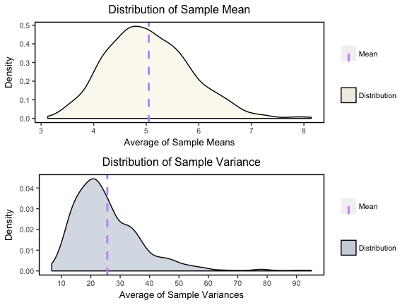
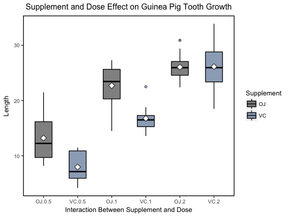

# Statistical Inference Course Project
Lawrence A. Tomaziefski  

***Part One: Simulation Exercise***

***Simulation Exercise Overview***
The purpose of this report is to demonstrate the Central Limit Theorem.  R is used to conduct three fairly simple simulations to show that regardless of the underlying distribution given a large enough sample of independant, identically, distributed (iid) variables the resulting distribution will be approximately normal.  The underlying distribution used in this exercise is the exponential distribution.

***Simulation Exercise***

The exponential distribution is the time between events in Poisson processes.  The probability density function:
$$f(x) = {\lambda}e^{-{\lambda}x}~~when~~x > 0 ~~and~~ 0~~for~ x \le 0$$
where $\lambda$ is the rate parameter (number of events per unit of time) and x defines time.  For the purposes of this exercise $\lambda = .2$.  The mean of the exponential distribution, or $\beta = 1/{\lambda}$.  Therefore, the theoretical mean for an exponential distribution with a $\lambda = .2$ is 5.0.  When 1000 random exponentials are simulated in R using the rexp function, a distribution with a long right tail is produced.  The mean of the distribution is  5.1, which is close to the theoretical mean of 5.0.  Figure 1 is a visual representation of the density of the simulated exponential distribution.


The central limit theorem states that the distribution of the sum (or average) of a large number of independent, identically distributed variables will be approximately normal, regardless of the underlying distribution.  To demonstrate this, the simulation outlined previuosly was taken one step furthe.  Rather than creating one sample population by simulating 1000 random exponetials, the r function rexp was used to create a large sample population by conducting the simulation above with 40 random exponentials, and then repeating the process 1000 times.  The sample means and variance was taken for each iteration of the simulation to create a sample population of just the means and variance of the iterations.  
The density plots of the sample means and variations demonstrates that mean and variances begin to converge around the theoretical mean and variance ($\sigma^2 = 1/\lambda^2 = 25$) of the exponential distribution.  


Taking the demonstration one step further the means of the sample population were normalized by subtracting the theortical mean and dividing by the error.  After normalizing, the sample mean $\bar{X} =$ 0.06 and standard deviation, $\sigma =$ 1 which is close to the normal distribution $N(0,1)$.


***

***Part Two: Statistical Inference of Tooth Growth Data***

***Exploratory Data Analysis***

According to the R documentation, the ToothGrowth dataset contains the response of tooth growth in guinea pigs to vitamin C.  Measurements of the odontoblast from 60 guinea pigs were recorded after being treated with vitamin C either given via orange juice (OJ) or ascorbic acid (VC) in three possible doses 0.5, 1, and 2 mg/day.  For each supplement (OJ or VC) and dose combinations 10 guinea pigs were sampled and thier odontoblast length was measured.  Therefore, thae data set consists of 6 independent groups.  Exploration of the sample data indicates that odontoblast length increases as vitamin C dose increase regardless of delivery method.  OJ seems to produce better tooth growth results, however both delivery methods appear to produce the same results with a dose of 2 mg/day.       


Supplement   Dose    Median Length   Mean Length
-----------  -----  --------------  ------------
OJ           0.5             12.25         13.23
OJ           1               23.45         22.70
OJ           2               25.95         26.06
VC           0.5              7.15          7.98
VC           1               16.50         16.77
VC           2               25.95         26.14

<!-- -->

Based on the exploratory data analysis, and assuming independent groups and equal variance, the following hypothesis are tested using the Student's T-Test with an $\alpha = 0.05$:


 + Hypothesis Test 1 (Supplement)  $H_o:~\mu_OJ = \mu_VC$ 
 + Hypothesis Test 2 (Dose)  $H_o:~\mu_1 mg/day = \mu_2 mg/day$    

The alternative hypothesis, $H_a$ for each of the listed test is that there is no difference in the true means.  

***Hypothesis Testing and Results***

Hypothesis Test 1 (Supplement)  $H_o:~\mu_OJ = \mu_VC$ 

```
## [1] -0.1670064  7.5670064
## attr(,"conf.level")
## [1] 0.95
```
0 is in the 95% confidence interval therefore ***reject*** the null hypothesis that there is a difference in the true means of the delivery methods.

Hypothesis Test 2 (Dose)  $H_o:~\mu_1 mg/day = \mu_2 mg/day$ 

```
## [1] -8.994387 -3.735613
## attr(,"conf.level")
## [1] 0.95
```
0 is not in the 95% confidence interval therefore, ***fail to reject*** the null hypothesis that there is a difference in the true means of dose.  The confidence interval indicates that a larger dose produces more tooth growth.

***Conclusions***

Based on the hypothesis test conducted, delivering vitamin C via OJ or VC will produce similiar tooth growth in guinea pigs.  However, a larger dose is more effective in promoting tooth growth.  

***

***Appendix***
***R Script For Simulation Exercise***


```r
#Statistical Inference Course Project
#compare_distros.R
#by Lawrence Tomaziefski
#2017-01-08
#_______________________________________________________________________________
#Script Begins
#-------------------------------------------------------------------------------------

require(dplyr)
require(ggthemes)
require(ggplot2)
require(xlsx)

#Establish a color pallete that will be used for making plots.  Note that to reproduce the graphs one will have to use thier own color palette.  

color_frame = read.xlsx("color_frame.xlsx",1,header = TRUE, stringsAsFactors = FALSE)
color_palette = color_frame %>%
        filter(palette == 1)
      
colors = c(unique(color_palette$color_code))

#Set the parameters for the simulations below.  
set.seed(10)
simulations = 1000
rand_exponentials = 40
lambda = .2

#This simulation produces an exponentional distribution for a 1000 random exponentials.  
exponential_dist = data.frame(distribution = rexp(simulations, rate = lambda))

#Denisty plot of exponential distribution.
exponential_graph = ggplot(exponential_dist, aes(x = distribution, fill = distribution)) +
        geom_density(aes(y =..density.., fill = "Distribution"),alpha = .2) +
        theme(panel.background = element_rect(fill = "white"),
              panel.grid.minor = element_line(color = NA),
              panel.grid.major.x = element_line(color = NA),
              panel.grid.major.y = element_line(color = NA),
              panel.border = element_rect(color = "black", fill = NA, size = 1),
              plot.title = element_text(hjust = 0.5),
              text = element_text(size = 10, color = "black"),
              plot.caption = element_text(hjust = 0.5)) +
        scale_x_continuous(breaks = seq(0, max(exponential_dist$distribution), by = 5)) +
        labs(y = "Density",
             x = "Time Between Events",
             title = "Exponential Distribution") +
        geom_vline(aes(xintercept= mean(distribution, na.rm = TRUE), color = "Mean"),  
        linetype = "dashed", size = 1) +
        scale_fill_manual(name = NULL, values = c(Distribution = color_palette$color_code[6])) +
        scale_color_manual(name = NULL, values = c(Mean = color_palette$color_code[9])) 

#This simulation produces a sample population of the average means and variances of 1000 sets of 40 random exponentials.  
simulation_output = data.frame()
        for (i in 1 : simulations){
        output = data.frame(output = rexp(rand_exponentials, rate = lambda))
        output = summarize(output, means = mean(output), variance = var(output))
        simulation_output = rbind(simulation_output, output)
        }
        
expected_mean = 1/lambda
standard_dev = 1/lambda
std_error = standard_dev/sqrt(rand_exponentials) 

simulation_output  = mutate(simulation_output, normal_mean = (means - expected_mean)/std_error)
sample_stats = simulation_output %>%
                summarize(mean = mean(means), variance = mean(variance), normalized_mean = mean(normal_mean), normal_var = mean(var(normal_mean)))
        
#Denisty plot of the mean of the sample population.          
        sample_mean_graph = ggplot(simulation_output, aes(x = means, fill = means)) +
                geom_density(aes(y =..density.., fill = "Distribution"),alpha = .2) +
                theme(panel.background = element_rect(fill = "white"),
                      panel.grid.minor = element_line(color = NA),
                      panel.grid.major.x = element_line(color = NA),
                      panel.grid.major.y = element_line(color = NA),
                      panel.border = element_rect(color = "black", fill = NA, size = 1),
                      plot.title = element_text(hjust = 0.5),
                      text = element_text(size = 10, color = "black"),
                      plot.caption = element_text(hjust = 0.5)) +
                scale_x_continuous(breaks = seq(0, 10, by = 1)) +
                labs(y = "Density",
                     x = "Average of Sample Means",
                     title = "Distribution of Sample Mean") +
                geom_vline(aes(xintercept= mean(simulation_output$means, na.rm = TRUE), color = "Mean"),  
                           linetype = "dashed", size = 1) +
                scale_color_manual(name = NULL, values = c(Mean = color_palette$color_code[10])) +
                scale_fill_manual(name = NULL, values = c(Distribution = color_palette$color_code[8])) 
        
#Denisty plot of the variance of the means in the sample population.         
        sample_var_graph = ggplot(simulation_output, aes(x = variance)) +
                geom_density(aes(y =..density.., fill = "Distribution"),alpha = .2) +
                theme(panel.background = element_rect(fill = "white"),
                      panel.grid.minor = element_line(color = NA),
                      panel.grid.major.x = element_line(color = NA),
                      panel.grid.major.y = element_line(color = NA),
                      panel.border = element_rect(color = "black", fill = NA, size = 1),
                      plot.title = element_text(hjust = 0.5),
                      text = element_text(size = 10, color = "black"),
                      plot.caption = element_text(hjust = 0.5)) +
                scale_x_continuous(breaks = seq(0, max(simulation_output$variance), by = 10)) +
                labs(y = "Density",
                     x = "Average of Sample Variances",
                     title = "Distribution of Sample Variance") +
                geom_vline(aes(xintercept= mean(simulation_output$variance, na.rm = TRUE), color = "Mean"),  
                          linetype = "dashed", size = 1) +
                scale_color_manual(name = NULL, values = c(Mean = color_palette$color_code[10])) +
                scale_fill_manual(name = NULL, values = c(Distribution = color_palette$color_code[4])) 
        
#Density plot of the normalized means.
        normal_mean_graph2 = ggplot(simulation_output, aes(x = normal_mean, fill = normal_mean)) +
                geom_density(aes(y =..density.., fill = "Distribution"),alpha = .2) +
                theme(panel.background = element_rect(fill = "white"),
                      panel.grid.minor = element_line(color = NA),
                      panel.grid.major.x = element_line(color = NA),
                      panel.grid.major.y = element_line(color = NA),
                      panel.border = element_rect(color = "black", fill = NA, size = 1),
                      plot.title = element_text(hjust = 0.5),
                      text = element_text(size = 10, color = "black"),
                      plot.caption = element_text(hjust = 0.5)) +
                scale_x_continuous(breaks = seq(-3, 3, by = .5)) +
                labs(y = "Density",
                     x = "Normalized Means",
                     title = "Distribution of Normalized Mean") +
                geom_vline(aes(xintercept= mean(simulation_output$normal_mean, na.rm = TRUE), color = "Mean"),  
                           linetype = "dashed", size = 1) +
                scale_color_manual(name = NULL, values = c(Mean = color_palette$color_code[10])) +
                scale_fill_manual(name = NULL, values = c(Distribution = color_palette$color_code[8])) 
```


***R Script For Statistical Inference***


```r
#Statistical Inference Course Project
#tooth_growth.R
#by Lawrence Tomaziefski
#2017-01-14
#_______________________________________________________________________________
#Script Begins
#-------------------------------------------------------------------------------------
require(dplyr)
require(ggthemes)
require(ggplot2)
require(datasets)
require(knitr)

#Read the ToothGrowth data into a data frame.  
tooth_growth = ToothGrowth

colnames(tooth_growth) = c("Length", "Supplement", "Dose")


growth_summary = tooth_growth %>%
        group_by(Supplement, Dose) %>%
        summarize('Median Length' = median(Length),
                  'Mean Length' = mean(Length))

growth_box = ggplot(tooth_growth, aes(x = interaction(Supplement, Dose),y = Length, color = Supplement)) + 
        geom_boxplot(aes(fill = Supplement), color = "black", alpha = .5, width = .5, outlier.size=1.5, outlier.shape=21, notch = FALSE) + 
        scale_fill_manual(values = c(color_palette$color_code[2],color_palette$color_code[4])) + 
        stat_summary(fun.y="mean", geom="point", shape=23, size=3, fill="white", color = "black") +
        theme(panel.background = element_rect(fill = "white"),
              panel.grid.minor = element_line(color = NA),
              panel.grid.major.x = element_line(color = NA),
              panel.grid.major.y = element_line(color = NA),
              panel.border = element_rect(color = "black", fill = NA, size = 1),
              plot.title = element_text(hjust = 0.5),
              text = element_text(size = 10, color = "black"),
              plot.caption = element_text(hjust = 0.5)) +
        labs(x = "Interaction Between Supplement and Dose",
             title = "Supplement and Dose Effect on Guinea Pig Tooth Growth")

#Test that Ho: mu_OJ = mu_VC
t.test(Length ~ Supplement, paired = FALSE, var.equal = TRUE, data = tooth_growth)$conf.int

#Test that Ho: mu_1 = mu_2
tooth_growth_dose = tooth_growth %>%
        filter(Dose >= 1)
t.test(Length ~ Dose, paired = FALSE, var.equal = TRUE, data = tooth_growth_dose)$conf.int
```


